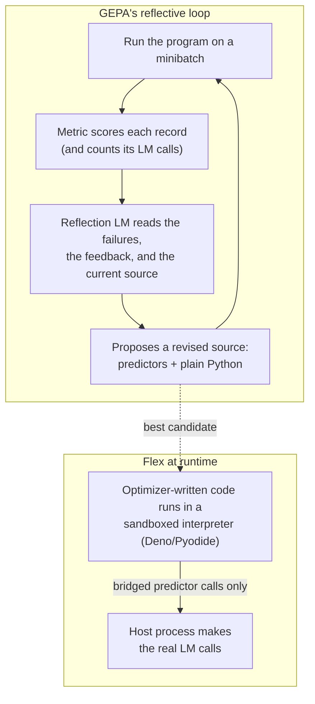
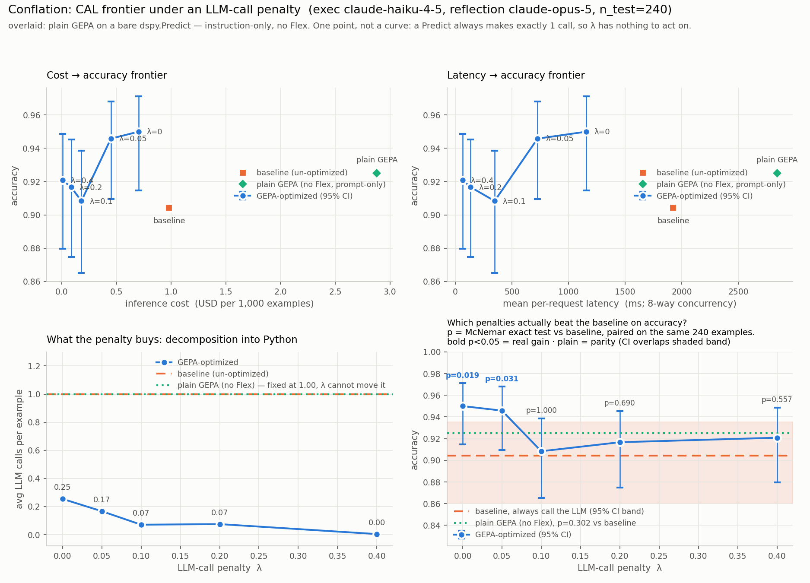

<!--
  DRAFT for dbreunig.com — guest post by Michael Isaac.
  Image paths are relative to this repo (blog/ -> tests/demos/conflation/all/).
  Copy the PNGs and re-point the paths when this moves to the blog.
  TODO markers throughout indicate links/names/numbers to confirm before publishing.
-->

# Let the Model Write the Code

*This is a guest post by Michael Isaac, a PhD student in programming languages at CMU, written during an internship at cmpnd <!-- TODO: link cmpnd, Michael's site -->. Michael works on DSPy's optimizers — including the new module this post introduces.*

Drew has spent two years on this blog making one argument from several angles: stop hand-tuning prompts. Declare the task, define a metric, and let an optimizer write the prompt — because [the model writes a better one than you will](https://www.dbreunig.com/2025/06/10/let-the-model-write-the-prompt.html), and because hand-tuned prompts [pile up debt](https://www.dbreunig.com/2026/06/22/the-problem-is-prompt-debt.html) that eventually freezes your system to an aging model.

I want to push that argument one step further: stop hand-writing the *program*.

The newest frontier models aren't just better classifiers and better writers. They are genuinely good software engineers. Taking advantage of them doesn't only mean swapping in a smaller, more capable model behind your existing pipeline — it means letting a frontier model's coding ability restructure the pipeline itself. That's what `dspy.Flex` does, and the results surprised even us.

## The task is not the implementation

The core promise of DSPy has always been separation of concerns. You write a Signature — the *what*:

```python
class SamePlace(dspy.Signature):
    """Decide whether two business listings refer to the same physical place."""

    input_name: str = dspy.InputField(desc="Name of place A.")
    input_address: str = dspy.InputField(desc="Street address of place A.")
    match_name: str = dspy.InputField(desc="Name of place B.")
    match_address: str = dspy.InputField(desc="Street address of place B.")
    distance: float = dspy.InputField(desc="Distance between the two coordinates.")
    is_same: bool = dspy.OutputField(desc="True if A and B are the same physical place.")
```

The *how* — the prompt format, the few-shot examples, the model-specific quirks — is the framework's problem. Which means that when the *how* improves, every program declared this way improves with it. Innovation arrives, and your Signatures just work.

Look at the history of what DSPy has treated as an optimizable artifact and there's a clear progression:

1. **Examples.** Bootstrap few-shot demonstrations from your data.
2. **Prompts.** Rewrite the instructions themselves — MIPROv2, then GEPA.
3. **Weights.** Distill the optimized program into finetuned models.
4. **Code.**

That last one is new. `dspy.Flex` makes the *source code of your module* an optimizable artifact — something an optimizer can read, reason about against a metric, and rewrite. Not just the words sent to the model, but the decision of when to call a model at all.

And here's the thing you give up nothing to get: you don't actually care what's underneath. You care that your task gets performed at a certain accuracy, at a certain cost, at a certain latency. Whether that's achieved by a beautiful prompt or by two hundred lines of address-parsing Python is an implementation detail — one you can now delegate.

## What Flex does

`dspy.Flex(SamePlace)` is a drop-in replacement for `dspy.Predict(SamePlace)`. Out of the box it *is* essentially a `Predict`: its starting implementation is a few lines of generated source — one predictor over your signature, wrapped in a plain `dspy.Module`:

```python
class SamePlaceModule(dspy.Module):
    def __init__(self):
        super().__init__()
        self.predict = dspy.Predict(SamePlace)

    def forward(self, **inputs):
        result = self.predict(**inputs)
        return dspy.Prediction(is_same=result.is_same)
```

The difference is what happens under optimization. When you hand a Flex module to `dspy.GEPA`, the optimizer doesn't just tune instruction strings. It reads the module's current source, reads a batch of failures with your metric's feedback attached, and — using a strong reflection model — proposes a *revised source*: decomposed predictors, plain Python helpers, routing logic, whatever the failures call for. The proposal is itself a DSPy program; the reflection model is told to pick the simplest primitive for each step — `dspy.Predict` by default, `dspy.ChainOfThought` when explicit reasoning helps, `dspy.RLM` or `dspy.ReAct` when a step needs tools, and *no LM call at all* when Python suffices.



Two details worth knowing before you worry about them:

- **The generated code never runs in your process.** Flex executes its source inside a sandboxed interpreter; only predictor calls and tool calls you explicitly provided bridge back to the host, and a `max_predictor_calls` cap bounds how many times per record it can do so.
- **The code round-trips.** `optimized.save("program.json")` persists the source; `dspy.Flex(SamePlace).load(...)` restores it. The artifact is a file you can open, read, diff, and code-review — which is more than can be said for most prompt archaeology.

Your calling code doesn't change. Your Signature doesn't change. One line changes:

```python
program = dspy.Flex(SamePlace)        # was: dspy.Predict(SamePlace)

optimized = dspy.GEPA(
    metric=make_metric(penalty=0.2),
    reflection_lm=dspy.LM("anthropic/claude-opus-5"),
    max_metric_calls=400,
).compile(program, trainset=train, valset=val)
```

## The same old conflation task

Which brings us to the demo, and to why this post is on this blog.

The task Drew has used to introduce prompt optimization — in [his 2024 walkthrough](https://www.dbreunig.com/2024/12/12/pipelines-prompt-optimization-with-dspy.html) and [his Data + AI Summit talk](https://www.dbreunig.com/2025/06/10/let-the-model-write-the-prompt.html) — is geospatial conflation for Overture Maps: given two place listings, decide whether they're the same physical place. It's deceptively hard in the tail. `KIN CAFE` vs `KIN` at the same address: same place. `CONCESSION #2 KEN MERCER SPORTS PARK` vs `KEN MERCER SPORTS PARK` at the same address: *not* the same place.

We ran Flex on exactly this task — 1,029 labeled pairs, the same shape of signature, no changes to the program besides that one line. This is the promise being cashed in: a program written for prompt optimization in 2024 picks up code optimization in 2026 for free.

The one new ingredient is the metric. GEPA metrics return a score plus natural-language feedback, and with Flex the metric can see the execution trace — including how many LM calls the program made on each record. So we charged for them:

```python
score = max(0.0, correct - PENALTY * n_llm_calls)
```

At `PENALTY = 0`, calls are free and the optimizer only chases accuracy. As the penalty λ rises, every LM call has to buy back more accuracy than it costs, and the optimizer is pushed to settle cases in Python and reserve the model for genuine ambiguity. (Push λ past 1.0 and a call can never pay for itself — that end of the dial simply means *never call the model*.) That single scalar is a dial over the **CAL frontier — cost, accuracy, latency**.

We swept λ ∈ {0, 0.05, 0.1, 0.2, 0.4}, with Claude Haiku 4.5 executing (the weakest, cheapest Claude — which is what makes the penalty a real tradeoff) and Claude Opus 5 reflecting. Caches disabled, so cost and latency are what a cold production call costs. Test set is 240 held-out records, class-balanced so 50% is chance.

| program | λ | accuracy | LM calls / record | $ / 1k records | mean latency* |
|---|---|---|---|---|---|
| `dspy.Predict` baseline | — | 90.4% | 1.00 | $0.98 | 1,924 ms |
| GEPA, prompt-only | — | 92.5% | 1.00 | $2.88 | 2,841 ms |
| Flex + GEPA | 0 | **95.0%** | 0.25 | $0.70 | 1,155 ms |
| Flex + GEPA | 0.05 | 94.6% | 0.17 | $0.45 | 726 ms |
| Flex + GEPA | 0.1 | 90.8% | 0.07 | $0.18 | 347 ms |
| Flex + GEPA | 0.2 | 91.7% | 0.08 | $0.09 | 135 ms |
| Flex + GEPA | 0.4 | 92.1% | 0.004 | **$0.01** | 65 ms |

<sub>*Mean per-request latency under 8-way concurrency. Full experiment writeup, per-example records, and significance tests live with the demo. <!-- TODO: link demo / EXPERIMENT.md when public --></sub>



A few things in that table deserve to be read slowly.

**With calls free (λ=0), the optimizer still wrote code.** Nobody asked it to cut costs — the metric was pure accuracy — but the best program it found routed 75% of records through deterministic Python and came out *more accurate* (95.0% vs 90.4%, McNemar p=0.019), 1.4× cheaper, and 1.7× faster than calling the model every time. The rules handle the easy cases better than a small model does, and the model gets reserved for the cases that actually need judgment.

**At λ=0.4, the program made one LM call in 240 records.** One. Accuracy held at 92.1% — statistically indistinguishable from the always-call baseline — at *130× lower cost* and 30× lower latency. To be precise about the claims, because the data is: only the λ=0 and λ=0.05 accuracy gains are statistically significant. The higher penalties buy parity, not improvement. But "same accuracy for a penny per thousand records" is the kind of parity production engineers dream about.

**Prompt-only optimization made inference *more expensive* than doing nothing.** This is my favorite row in the table. Run plain GEPA on a bare `dspy.Predict` — same budget, same models, no Flex — and you get 92.5% accuracy at $2.88 per thousand records, 2.9× the cost of the un-optimized baseline. That's not a bug; it's the only move available. A prompt optimizer's lever is the instruction, so it lengthens it, and every record pays for those extra tokens on every call, forever. It has no mechanism to trade a call away. Prompt-only optimization is a *point*. Code optimization is a *frontier*.

## Reading the code it wrote

The saved artifact for λ=0.4 is a JSON file with a `module_src` field, and it's worth actually reading. Condensed:

```python
class SamePlaceModule(dspy.Module):
    def __init__(self):
        super().__init__()
        # The LLM is a LAST-RESORT fallback: it is only consulted for the narrow band of
        # pairs where the deterministic signals genuinely conflict (e.g. clearly the same
        # brand/name but at a mismatching house number and a middling distance).
        self.judge = dspy.Predict(dspy.Signature(
            "input_name: str, input_address: str, match_name: str, match_address: str, "
            "distance: float, name_similarity: float, address_analysis: str -> is_same: bool",
            "You perform entity resolution on business/POI listings. [...] "
            "3. The house number is the strongest address signal. [...] "
            "4. The same brand name far apart means two different branches => NOT the same place."
        ))

    def forward(self, **inputs):
        import re, difflib
        # ~150 lines: normalize names (strip '#30696', 'LLC', generic words like CAFE/GRILL),
        # parse addresses into house number + street core, compute fuzzy similarities...

        if name_same:
            if addr_same and (d is None or d <= 400.0):
                decision = True
            elif hn_diff and d is not None and d > 120.0:
                decision = False   # same brand, different street numbers => branches
            # ...
        elif name_diff:
            decision = False       # distinctive name parts disagree
        # ...

        if decision is None:       # the rules genuinely can't decide -> ask the model
            out = self.judge(**inputs, name_similarity=round(nsim, 3),
                             address_analysis=analysis)
            decision = to_bool(out.is_same)
        return dspy.Prediction(is_same=bool(decision))
```

That comment at the top — "the LLM is a LAST-RESORT fallback" — was written by the optimizer, about its own architecture. It parsed addresses. It built a stoplist of generic business words. It learned that a shared house number is the strongest address signal and that the same brand name 500 meters apart means two branches, not one place. And where the deterministic signals conflict, it hands the record — along with its *own analysis* as extra input fields — to a small, sharply-instructed LM judge.

Notice it also rewrote the judge's prompt. The predictor instructions live inside the source, so evolving the code and evolving the prompts are the same operation. This isn't code optimization *instead of* prompt optimization. It's prompt optimization with a bigger vocabulary.

The whole sweep — five GEPA compiles, evaluations, baselines, statistical validation — cost $12.60 in API spend. The λ=0.4 compile alone was about a dollar.

## Where this comes from

Flex sits at the intersection of a few research threads, and credit belongs where it's due:

- **GEPA** — Lakshya Agrawal's reflective prompt evolution, which showed that an LM reading execution traces and metric feedback can out-optimize reinforcement learning on rollout efficiency. Flex extends GEPA's reflection target from instructions to source. <!-- TODO: link GEPA paper -->
- **MetaHarness** — work at MIT with Omar Khattab and Yoonho Lee <!-- TODO: confirm names + link --> on treating the harness around a model as a learnable object.
- **RLM** — Alex Zhang's Recursive Language Models, where a model explores a large input programmatically instead of swallowing it whole. RLM is one of the primitives Flex's optimizer can reach for when a step needs it. <!-- TODO: link RLM post -->

My own background is programming languages, which is perhaps why this feels less like a trick and more like the natural next compiler pass: programs are data, data can be optimized against an objective, and now the objective can be "accuracy minus what you cost me."

## Deterministic or stochastic? Let the metric decide

A core skill emerging among people who build with agents is knowing when to go deterministic and when to go stochastic. What do you give to code, and what do you give to the model? Give the model too little and you've built a brittle rule engine with extra steps. Give it too much and you're paying 2,000ms and real money for `if distance > 500: return False`.

Today that boundary is drawn by hand, by intuition, and it's drawn *once* — even though the right answer depends on your model, your data distribution, and your budget, all of which change.

Flex turns that boundary into a searchable, priced decision. In the conflation sweep you can watch it move: as λ rises from 0 to 0.4, the share of records settled in pure Python climbs from 179 of 240 to 239 of 240, and the cases still routed to the model get consistently harder — which is exactly what deferral is supposed to mean. The boundary isn't a design decision anymore. It's an operating point on a frontier, and you pick it with a scalar.

## A harder task: optimizing the harness

Conflation is deliberately simple — one signature, one boolean out. The more interesting question is what happens on a task that's genuinely hard: *extract a structured report from a pile of files*, the kind of work that in a law firm is handed by a partner to an associate.

We're testing this with a Harvey-style legal benchmark <!-- TODO: confirm how to describe the eval + partnership -->: prepare a memo from case materials, evaluated against 50–60 criteria, each one an LLM judge. This is the "harness" regime — the program around the model (document handling, decomposition, drafting, self-checking against the rubric) matters as much as the model itself.

Early signals, for honesty's sake: a bare `dspy.Predict` baseline scores 0% — the task is simply beyond a single call. Switching the seed to an RLM lifts it to 2% (Opus 4.5 executing, 4.8 reflecting). From there, optimization is where it gets interesting: the program *branches*. Candidates emerge with one RLM call, with two, with RLM followed by ChainOfThought; distinct sub-processes appear for memo drafting versus judge-criteria preparation.

<!-- ═══════════════════════════════════════════════════════════════
     PLACEHOLDER: Harvey / Harness results

     Pending final runs. To fill in:
       - final score progression (0% -> 2% -> X% across GEPA iterations)
       - the winning program architecture (how many RLM calls, what decomposition)
       - cost per memo, before/after
       - a figure: score vs. optimization step, and/or the program's
         architectural evolution across candidates
       - any quotable generated code (e.g., the judge-prep sub-process)
     ═══════════════════════════════════════════════════════════════ -->

*[Results forthcoming — this section will be completed when the Harness runs finish.]*

## Four things an optimizer does to code

Watching GEPA rewrite programs across these tasks, the same four mechanisms keep showing up. They're worth naming, because they're exactly the moves a good engineer makes:

1. **Decomposing.** Identifying that a task has steps — parse, normalize, compare, decide — and giving each step its own implementation.
2. **Method selection.** Choosing, per step, between deterministic code and a stochastic call — and among `Predict`, `ChainOfThought`, `RLM` — the same deterministic-vs-stochastic judgment from above, made explicitly and per-step.
3. **Routing.** Recognizing that different *inputs* are different tasks: clear cases down the cheap path, ambiguous ones to the judge, with the program's own analysis forwarded as context.
4. **Evolving.** Once the structure settles, refining the signatures and instructions of the decomposed parts — the classic GEPA move, now applied to predictors the optimizer itself created.

Hand-written harnesses do all four of these too. They just do them once, at design time, frozen in whatever your intuitions were the week you wrote them.

## Your harness is next

Two years ago the lesson on this blog was: don't write the prompt — specify the task and the metric, and let the optimizer write the prompt. The lesson hasn't changed. The optimizer just got a bigger toolbox.

Codifying a classifier is the simplest possible use case, and it already moved the whole cost-accuracy-latency frontier. But nothing about Flex is specific to classification. The demo suite already stretches further: one experiment replaces an LLM-as-a-judge with a GEPA-synthesized Python judge program; another hands Flex the agent loop of a terminal-tasks benchmark — three Docker tools, with the optimizer rewriting the harness that wields them. <!-- TODO: link pajama + terminal-bench demos when public --> Your agent's scaffolding, your retrieval glue, your judge panels, your report-extraction pipeline — all of it is code wrapped around model calls, all of it embodies guesses about where the deterministic/stochastic line should sit, and all of it can now be optimized against the only things you actually care about: what it costs, how long it takes, and how often it's right.

Don't program your prompt. Don't hand-tune your harness either. Declare the task, price what you care about — and let the model write the code.

---

<sub>*The conflation demo, the full experiment writeup (including significance tests and limitations), and the saved optimized programs are available in the DSPy repo. <!-- TODO: link when public --> `dspy.Flex` is experimental, landing in DSPy 3.3.*</sub>
