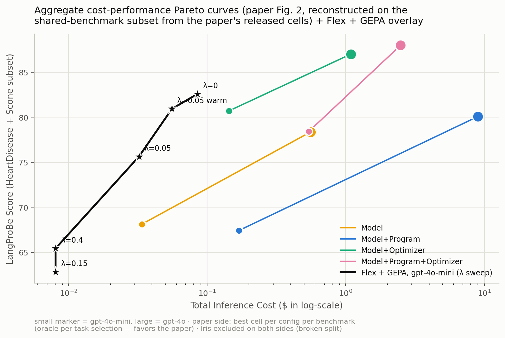
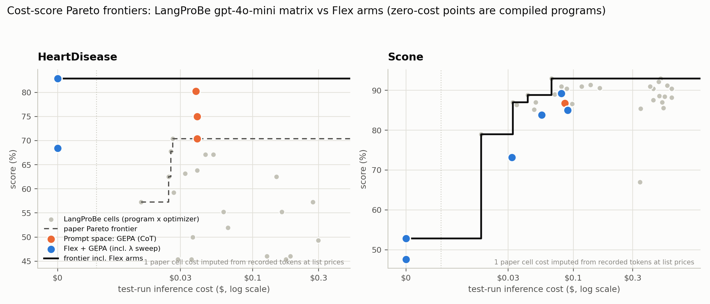
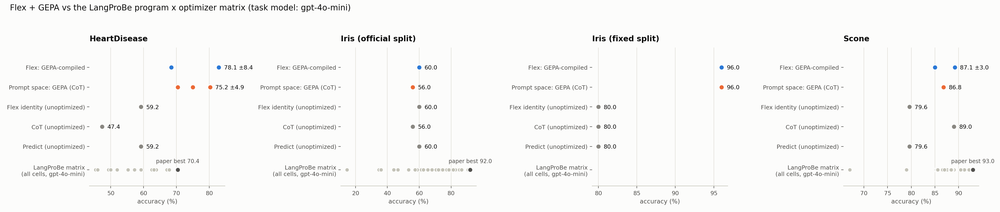
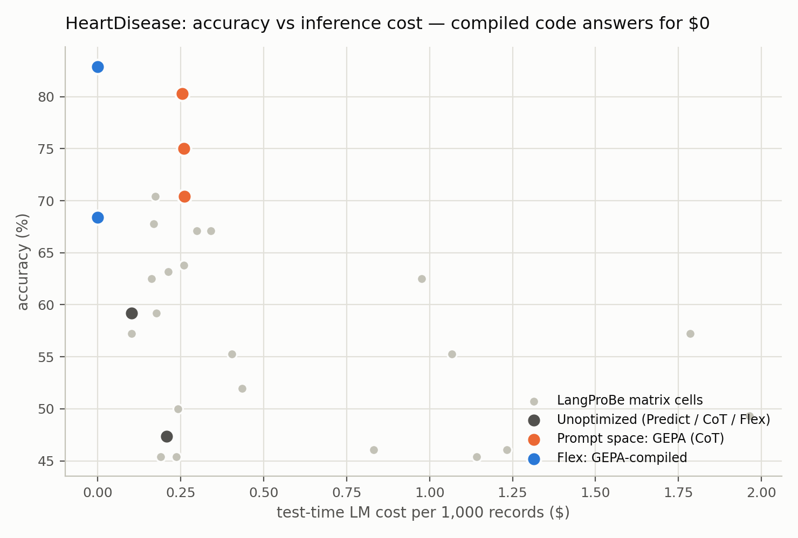

# Flex on LangProBe — pilot results (2026-09-03/04)

Evaluates `dspy.Flex` (code as the optimizable parameter) inside the LangProBe
benchmark (Tan et al., Findings of EMNLP 2025), against the paper's own published
gpt-4o-mini matrix, which ships in their repo (`experiment_data/20250305/gpt4omini_0305.csv`).

## Setup

- **Harness**: LangProBe's own benchmark classes (data, seeded splits) and metric
  (`answer_exact_match`). One-line upstream import fix in `HeartDisease_program.py`
  (missing `LangProBeDSPyMetaProgram` import); no other benchmark-code changes.
- **Task model**: `gpt-4o-mini` (the paper's model — numbers are directly comparable).
  **Reflection model**: `gpt-5-mini`.
- **Arms** — same optimizer (GEPA), same budget, same data; only the parameter
  space differs:
  - B0: unoptimized Predict / CoT / Flex-identity
  - B1: **prompt space** — GEPA over a CoT student, 500 metric calls, valset 40, train 15
  - B2: **Flex + GEPA** — GEPA over the code space, same budget/data/metric/seeds;
    on Scone additionally swept with an LM-call penalty λ in the metric
    (score − λ·calls, via GEPA's `program_trace` hook)
- **Seeds**: HeartDisease ×3 for B1/B2; Scone ×2 for B2; Iris ×1 (pilot).
- **Tasks**: HeartDisease (UCI, 152 test), Iris (75 test), Scone negation
  reasoning (500 test). Iris additionally run on a corrected split (below).

**Replication fidelity** (unoptimized baselines, ours vs paper): Heart Predict
59.2 vs 57.2 · Iris Predict 60.0 vs 58.7 · Scone Predict 79.6 vs 79.0 · Scone
CoT 89.0 vs 88.8 — the harness reproduces their numbers.

## Results

See `results/summary.md` for auto-generated tables, `results/*_module_src.py`
for the compiled artifacts, and `results/results.jsonl` for every run.

### Figures

**Paper Figure 2 methodology, applied to the shared-benchmark subset, with
Flex + GEPA on top.** Same chart form as the paper's Fig. 2 (mean score vs.
total inference cost, log-x, four configuration classes as curves over models),
rebuilt from their released per-cell data — but averaged over ONLY the 2 shared
benchmarks (HeartDisease + Scone; Iris excluded on both sides — see F4), so
y-values are much higher than the published 15-dataset figure on BOTH sides and
are not comparable to it. Within the chart the comparison is apples-to-apples,
and the paper side gets oracle per-task cell selection (best cell per config
per benchmark), which Flex + GEPA — one uniform recipe — does not. Flex is the
starred curve, one star per λ.



**Per-task cost-score Pareto frontiers** (log-cost, hull lines; compiled
programs at the $0 column). On HeartDisease the combined frontier is a flat line
anchored at $0 by Flex + GEPA (82.9 vs. paper frontier peak 70.4). On Scone the
paper's best cells retain the top of the frontier (93.0 at ~$0.07); the λ sweep
targets the cheap end. A few paper cells have no recorded cost (cost=0 in their
CSV); their costs are imputed from the rows' recorded token counts at OpenAI
list prices — a formula verified to reproduce the paper's recorded costs exactly.



**Accuracy vs the full matrix, per task.** Every gray dot is one of the paper's
program×optimizer cells; our arms are the labeled rows (one dot per seed).



**HeartDisease cost-accuracy detail (linear axis, per-1k-records units).**



| task (n_test) | paper best cell | prompt space: GEPA (B1) | Flex + GEPA (B2) |
|---|---|---|---|---|
| HeartDisease (152) | 70.4 | 75.2 ± 4.9 @ $0.26/1k | **78.1 ± 8.4 @ $0** |
| Iris, official split (75) | 92.0 | 56.0 (no-op, see F4) | 60.0 (no-op, see F4) |
| Iris, fixed split (75) | n/a (not comparable) | 96.0 @ $0.17/1k | **96.0 @ $0** |
| Scone (500) | 93.0 | 86.8 | **89.2** (seed 1: 85.0; λ sweep in F2b) |

## Findings

**F1 — Flex + GEPA beats the paper's entire HeartDisease matrix at zero
inference cost.** Every one of the paper's 21 program×optimizer cells is ≤70.4;
Flex + GEPA reaches 78.1, answering the full test set without a single LM call
(the artifacts are pure-Python risk scorers over the 13 clinical features).
Part of the accuracy delta is GEPA itself (prompt-space GEPA reaches 75.2),
which the paper predates; the $0-inference property is exclusive to the code
parameterization.

**F2 — GEPA places the code/model boundary where it belongs.** On tabular tasks
it compiles pure code (heart, iris_fixed: 0 LM calls); on Scone (negation
reasoning) it **learns to delegate**: the compiled program is a single
ChainOfThought predictor with an evolved logical-entailment instruction
(negation scope, hyponym/hypernym rules), scoring 89.2 vs 86.8 for the same
optimizer confined to prompt space. The λ sweep below trades that boundary
explicitly against cost.

**F2b — The Scone λ sweep: a clean negative result with a methodological
lesson.** Penalizing LM calls in the metric (score − λ·calls) cannot improve
Scone, because Scone has no cheap head to route away — every instance needs the
model, so the only metric-visible moves are dropping calls (accuracy collapses
to near-chance) or keeping them (no gradient on cost):

| Scone arm | accuracy | calls | test cost | on per-task frontier? |
|---|---|---|---|---|
| Flex+GEPA, λ=0 (seeds 0/1) | 89.2 / 85.0 | 500 | $0.080 / $0.090 | no (paper: 88.8 @ $0.043, 93.0 @ $0.067) |
| λ=0.05 (cold) | 73.2 | 473 | $0.032 | no |
| λ=0.05 (warm-start from λ=0 artifact) | 83.8 | 495 | $0.056 | no |
| λ=0.15 / λ=0.4 | 47.6 / 52.8 | 0 | $0 | no (≈ chance) |

The real cost lever on delegation-bound tasks is tokens per call, which a
per-call λ cannot see — a dollar-denominated penalty is the right currency
(future work). The warm-start run also demos *continual recompilation*: restart
GEPA from a saved artifact under a new metric, no from-scratch compile.
In the **aggregate** view (paper Fig. 2 reconstruction) the λ-parameterized
Flex curve nonetheless holds the entire frontier below ~$1 total cost: the
paper configurations that outscore λ=0 (gpt-4o + optimizers, 87–88) cost
14–33× more.

**F3 — Boundary sanity.** Given a code space, GEPA did not force code where it
doesn't belong: Scone compiled to pure delegation (500 calls, 89.2 > GEPA-prompt
86.8), while heart/iris compiled to pure code (0 calls). The routing landed where
it should on all tasks.

**F4 — LangProBe's Iris split is degenerate (benchmark bug).** The class-sorted
source file is never shuffled: train = 15×setosa only, val ≈ 88% setosa, test =
virginica+versicolor only (zero class overlap with train). GEPA correctly no-ops
(the identity baseline is already perfect on the broken valset), which is how the
bug surfaced. All Iris numbers in the paper's matrix were measured under this
pathology. `iris_fixed` (seeded shuffle, same sizes — **not comparable to paper
numbers**) gives the clean result: both GEPA arms 96.0, Flex at $0.

**F5 — Variance.** GEPA-Flex heart seeds: 82.9, 82.9, 68.4 — the seed-2 regression
shows a 40-example valset can select an overfit code candidate. Multi-seed
reporting is mandatory for any paper claim; per-arm accuracy differences at
these n's are not individually significant, while the cost separations ($0 vs
per-call) are categorical.

**F6 — The benchmark caught a real Flex bug** (fixed in this working tree, with
regression tests): the identity baseline dropped field `desc`/`prefix` metadata,
violating "starts as exactly your old Predict" (0% vs 40% on the first smoke).
Fix: dict-form signature reconstruction (`render_signature_source`), sandbox-shim
`InputField`/`OutputField` markers, host-side `_resolve_field_signature`.

## Caveats

- One task model, one reflection model, 1–3 seeds; treat accuracy deltas as
  directional, cost deltas as exact.
- UCI Heart/Iris are famous datasets: pretraining contamination is likely
  (Scone is the least contaminated task here).
- GEPA is not in the paper's optimizer set, so "beats the matrix" conflates
  optimizer quality with search space; the within-GEPA comparison (B1 vs B2) is
  the controlled one.
- Reflection-model asymmetry: the paper's optimizers pass no prompt/teacher
  model, so their proposers default to the task model itself (gpt-4o-mini rows
  were optimized *by* gpt-4o-mini); our GEPA arms use a separate, stronger
  reflection model (gpt-5-mini). This is a compile-time advantage on our side —
  it does not affect test-time cost, and B1 vs B2 share the same reflection
  model, so that comparison stays controlled.
- Total pilot cost: < $5 (task-side < $1; reflection ~ $2–3). Compiles: 8–15 min each.

## Reproduce

```
.venv/bin/python tests/demos/langprobe-flex/run_bench.py <heart|iris|iris_fixed|scone> \
    <baselines|gepa_cot|gepa_flex> [seed]        # plus: scone gepa_flex_lam <seed> <lambda>
.venv/bin/python tests/demos/langprobe-flex/aggregate_plots.py
```
