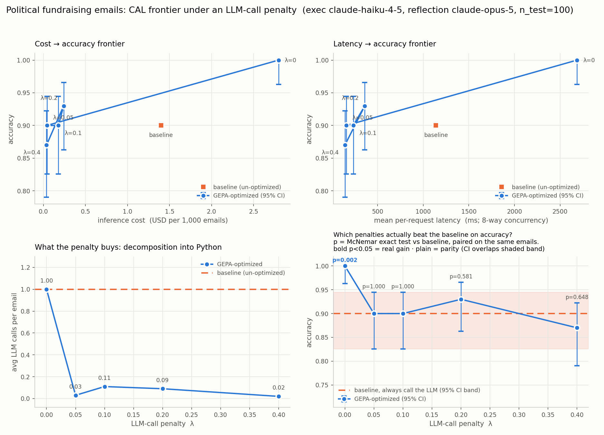

# Political fundraising emails under an LLM-call penalty: a CAL (cost / accuracy / latency) sweep

Companion to `tests/demos/conflation/all/EXPERIMENT.md`, run on a *string extraction* task instead of
binary classification. Same question: does penalizing LLM calls inside a GEPA objective push
`dspy.Flex` to decompose an LLM program into deterministic Python, and what does that cost?

**Short answer — and it differs sharply from conflation.** The penalty is a **switch, not a dial**:

- **λ=0** (calls free) — GEPA keeps 1.000 calls/email but restructures the signature (adds a
  Python-extracted `disclaimer_snippets` input and a `Reasoning:` output), and reaches
  **100% accuracy** (McNemar p=0.002 vs baseline). It buys that with **2× the cost and 2.4× the
  latency** of the un-optimized baseline.
- **Any λ > 0** — the program collapses to near-zero LLM calls (1.000 → 0.02–0.11) at **6–35× lower
  cost**, and accuracy drops to 0.87–0.93. Every penalized run is significantly worse than λ=0
  (p=0.0002–0.016) and **statistically indistinguishable from each other** (p=0.15–0.51) *and* from
  the baseline.

There is no useful middle. Once the penalty is nonzero its magnitude barely matters.

Total API spend: **$61.73** — of which **$24.51 was rework** (see §7).

---

## 1. Task and data

Given the full text of a political fundraising email, return the legal name of the sponsoring
committee. Scored by a fuzzy matcher (`match()`) tolerant of parser whitespace, punctuation, case and
`INC.`-style suffixes, but strict enough to reject a whole-disclaimer dump.

- `eval_data/train.jsonl` — 150 rows, 98 unique committees.
- `eval_data/val.jsonl` — 50 rows, 39 unique committees, **19 of which never appear in train**.
- Emails run ~2,500 characters (~650 tokens) median.

**The dataset files are read-only throughout.** Two dataset-adjacent operations happen in memory at
load time and change nothing on disk:

1. **Deduplication.** `train.jsonl` contains two email bodies twice (labels agree in both cases).
   Un-deduplicated, one copy landed in GEPA's training pool and the other in the test set — the same
   email trained on and tested against. `load_splits` skips the second copy, giving 148 unique rows.
2. **Re-randomizing the val/train partition** — see §2.

### Splits

| split | source | n | role |
|---|---|---|---|
| GEPA train | train.jsonl | 58 | reflection minibatches (size 4) |
| GEPA val | train.jsonl | 40 | candidate selection |
| **test** | **val.jsonl (50) + train.jsonl holdout (50)** | **100** | reported metrics |

The test set doubles `val.jsonl` with 50 held-out `train.jsonl` rows purely for statistical power —
50 rows alone gives ±4.2 pp standard error, 100 gives ±2.2 pp. `summarize` reports the two halves
separately (`by_source`) so `val.jsonl`'s unseen-committee property stays legible; the baseline
scores 0.90 on both halves, so pooling is sound. Test/train overlap verified at **0**.

---

## 2. Method

### Objective

For each penalty λ, GEPA optimizes `max(0, correct − λ · n_llm_calls)`. The metric feedback names
the goal (a correct answer from deterministic code with no LLM call) and states only the data
property that makes it possible — never *where* in the text the name is, or *how* to extract it.

Swept **λ ∈ {0, 0.05, 0.1, 0.2, 0.4}**, `reflection_minibatch_size=4`, `seed=0`, 8 threads,
`skip_perfect_score=False`, `max_metric_calls=600` (λ=0 at 200 — see §5).

### Models — chosen by pilot, not assumption

A 30-email pilot of all three tiers:

| exec model | accuracy | $/1k | mean latency |
|---|---|---|---|
| opus-4-7 (the demo's original) | 0.967 | $9.27 | 2303 ms |
| sonnet-5 | 0.933 | $5.53 | 2103 ms |
| **haiku-4-5 (chosen)** | **0.967** | **$1.43** | **1338 ms** |

Haiku matched Opus example-for-example (both missed only `Georgia Blue PAC`) at 6.5× lower cost.
Sonnet was worst — it returned `NRSC (National Republican Senatorial Committee)`, which the fuzzy
matcher rejects. Reflection LM: `claude-opus-5`.

### The seed prompt is deliberately minimal

One line: *"Identify the political committee that sponsored a fundraising email."* The original
signature carried a second paragraph telling the model the committee name is present in the email
text. That leaked a substantive task hint (turning inference into copy-from-text) *and* put
GEPA-directed guidance into the execution prompt. Measured, it was worth **2 pp** (0.910 → 0.890),
so it was not the reason the baseline was strong — but it is removed regardless.

### Instrumentation

dspy caches disabled, so latency and cost are cold-call values. Per-example cost from
`dspy.track_usage()` tokens priced through an explicit table, cross-checked against litellm's own
per-call cost (they agree to the cent). Latency reported as **per-request** (mean/p50/p95) *and* as
wall-clock throughput (`wall_s/n`); these differ several-fold under the 8-thread pool. Every
per-example record is persisted, so any metric can be recomputed without re-running.

**Truncation detection** counts calls with `finish_reason == "length"` — added after a silent
truncation destroyed an entire run (§7).

---

## 3. Results

100-email held-out test set. `acc@val` is the `val.jsonl` half alone (unseen-committee-rich).
`req ms` is per-request latency; `ms/ex` is wall-clock throughput.

| λ | acc | acc@val | mP | mR | mF1 | calls/email | $/1k | req ms | ms/ex | score | p vs base |
|---|---|---|---|---|---|---|---|---|---|---|---|
| baseline | 0.900 | 0.920 | 0.925 | 0.918 | 0.920 | 1.000 | 1.40 | 1140 | 148 | — | — |
| **0** | **1.000** | 1.000 | 1.000 | 1.000 | 1.000 | 1.000 | 2.80 | 2686 | 350 | 1.000 | **0.002** |
| 0.05 | 0.900 | 0.880 | 0.881 | 0.881 | 0.881 | 0.030 | 0.04 | 157 | 27 | 0.899 | 1.000 |
| 0.1 | 0.900 | 0.920 | 0.851 | 0.851 | 0.851 | 0.110 | 0.18 | 233 | 42 | 0.889 | 1.000 |
| 0.2 | 0.930 | 0.920 | 0.910 | 0.910 | 0.910 | 0.090 | 0.24 | 359 | 92 | 0.912 | 0.581 |
| 0.4 | 0.870 | 0.880 | 0.866 | 0.856 | 0.858 | **0.020** | **0.04** | **141** | **24** | 0.862 | 0.648 |



*Regenerate with `python sweep_penalties.py --plot-only` (reads the JSON, no API calls).*

### 3.1 λ=0: not a pure prompt win — a hybrid

GEPA left `calls/email` at exactly 1.000, so every email still reaches the LLM. But it did more than
rewrite the prompt: it **restructured the signature on both sides**.

```
baseline:  Email Body:                        ->  Committee:
λ=0:       Email Body:, Disclaimer Snippets:  ->  Reasoning:, Committee:
```

- **New input `disclaimer_snippets`** — Python regex pulls ~220 characters around every
  "Paid for by"-style phrase and passes them as pre-extracted evidence.
- **New output `Reasoning:`** — an explicit chain-of-thought step before the answer.
- **A 2,124-character instruction** encoding domain rules: the disclaimer convention, "never a
  donation platform (ActBlue, WinRed, Anedot)", and output rules. One of them is exactly the fix the
  error analysis predicted — *"If the disclaimer uses an acronym, output ONLY that acronym … Never
  output a form like 'Full Name (ACRONYM)'"* — which kills the `NRSC (National Republican Senatorial
  Committee)` error class.

So λ=0 **does** run Python; it runs it *before* the LLM as evidence extraction rather than *instead
of* it. The penalty at λ>0 flips that same logic from evidence into answer.

Result: **100/100**, McNemar **p=0.002 with 10 fixes and 0 regressions**.

This survived four attempts to discredit it:

| check | result |
|---|---|
| Is the fuzzy matcher inflating it? | No — **95/100 exact** after normalization; the 5 fuzzy matches are legal-suffix cases (`BOB CASEY FOR SENATE INC.` → `Bob Casey for Senate`) |
| Did it memorize committee names? | No — **0 test gold labels appear anywhere in the generated code**; the only string literals are variants of `"Paid for by"` |
| Does it handle unseen committees? | Yes — the `val.jsonl` half is also 100%, and 19/39 of its committees never appear in training |
| Truncated? | No — 0 truncated calls, peak 21,714 of a 24,000 cap |

The cost is real: **$2.80/1k vs $1.40 and 2686 ms vs 1140 ms**. The 2× is an even split between the
two structural additions, per-email:

| | baseline | λ=0 | change | $/1k impact |
|---|---|---|---|---|
| prompt tokens | 1272 | 1974 | +702 (1.55×) | +$0.702 |
| completion tokens | 25.4 | 164.8 | **+139 (6.5×)** | +$0.697 |

The `disclaimer_snippets` evidence drives the prompt growth; the `Reasoning:` field drives the
completion growth. Because Haiku output costs 5× input ($5 vs $1 per Mtok), the 139 extra output
tokens cost as much as the 702 extra input tokens — **50/50**, not a prompt-length story.

### 3.2 Any nonzero penalty is a cliff, not a slope

`calls/email` goes **1.000 → 0.030** at λ=0.05 — a 33× collapse from the smallest penalty tested —
and then wanders non-monotonically (0.030, 0.110, 0.090, 0.020) with no further trend. Quadrupling
λ from 0.1 to 0.4 changes nothing systematic.

Statistically:

| comparison | p | verdict |
|---|---|---|
| λ=0 vs λ=0.05 | **0.0020** | significant |
| λ=0 vs λ=0.2 | **0.0156** | significant |
| λ=0 vs λ=0.4 | **0.0002** | significant |
| λ=0.05 vs λ=0.2 | 0.5078 | not significant |
| λ=0.05 vs λ=0.4 | 0.3750 | not significant |
| λ=0.2 vs λ=0.4 | 0.1460 | not significant |

**Two regimes, cleanly separated, with nothing resolvable inside the penalized one.** Conflation
showed the same two-regime structure but with a gentler transition (between λ=0.05 and 0.1) and no
significant separation at either end. Here the separation is unambiguous and the transition is
immediate.

### 3.3 The practical choice

- **Accuracy at any price:** λ=0 → 100% at $2.80/1k, 2686 ms.
- **Cost/latency at any price:** λ=0.4 → 87% at $0.04/1k (**35× cheaper**), 141 ms (**19× faster**).
- **Balanced:** λ=0.2 → 93% at $0.24/1k (5.8× cheaper), 359 ms — above baseline accuracy though not
  significantly (p=0.581).

No penalized run is significantly *worse* than the un-optimized baseline either, so the decomposed
programs deliver baseline-class accuracy at a fraction of the cost.

---

## 4. Comparison with the conflation experiment

| | conflation (binary classification) | emails (string extraction) |
|---|---|---|
| baseline | 0.904, 1.00 calls, $0.98/1k | 0.900, 1.00 calls, $1.40/1k |
| λ=0 | 0.950, **0.254 calls** — already decomposing | 1.000, **1.000 calls** — no decomposition at all |
| best cheap point | λ=0.4: 0.921 at $0.01/1k | λ=0.4: 0.870 at $0.04/1k |
| λ=0 vs baseline | not tested until late; **not significant** for λ≥0.1 | **significant, p=0.002** |
| structure | two regimes, gentle transition, nothing significant | two regimes, **cliff**, endpoints clearly separated |
| run-to-run noise | ±1.2 pp (baseline re-measured) | **0.0 pp** (baseline identical across 3 measurements) |

The tasks differ in a way that explains most of this. Conflation's label needs a *judgment*
(are these the same place?), so even at λ=0 GEPA found deterministic rules worth writing, and the
LLM was only ~90% accurate anyway. Email attribution is *extractive* — the answer is a literal
substring of a disclaimer line — so a good prompt solves it perfectly, while regex-style parsing
plateaus around 87–93% on disclaimer formats it has not seen.

---

## 5. Budget adequacy

`budget_check.py` diagnoses whether GEPA had enough rollouts, by asking *where in the run the winning
candidate appeared*. Final verdicts:

| λ | iterations | proposals | accepted | base val | best val | found at | verdict |
|---|---|---|---|---|---|---|---|
| 0 | 15 | 15 | 1 | 0.900 | 1.000 | iter 2 | val **ceiling** — 200 calls suffice |
| 0.05 | 20 | 20 | 10 | 0.831 | 0.974 | iter 11/20 | plateaued, adequate |
| 0.1 | 20 | 20 | 10 | 0.788 | 0.963 | iter 5/20 | plateaued, adequate |
| 0.2 | 17 | 13 | 7 | 0.700 | 0.950 | iter 11/17 | plateaued, adequate |
| 0.4 | 20 | 20 | 10 | 0.540 | 0.950 | iter 10/20 | plateaued, adequate |

This mattered. At `max_metric_calls=200`, λ=0.2 reported **best found at iteration 4 of 4 — still
climbing**, and its result understated the truth on every axis:

| λ=0.2 | accuracy | calls/email | $/1k |
|---|---|---|---|
| @200 (starved) | 0.890 | 0.270 | $0.51 |
| **@600** | **0.930** | **0.090** | **$0.24** |

More budget produced a program simultaneously more accurate, 3× more deterministic and half the
cost. The starved run is retained in `penalty_sweep.json` under `starved_runs` as evidence.

λ=0 is the exception: it hits a perfect val score at iteration 2, so extra budget provably cannot
help, and it stays at 200.

---

## 6. Reproducibility

```bash
python sweep_penalties.py --penalties 0 --max-metric-calls 200      # λ=0 (val ceiling)
python sweep_penalties.py --penalties 0.05 0.1 0.2 0.4 --resume     # penalized runs at 600
python sweep_penalties.py --plot-only                               # re-render, no API calls
python budget_check.py sweep_600.log                                # was the budget enough?
```

| file | contents |
|---|---|
| `emails_common.py` | signature, splits, metric factory, CAL + truncation instrumentation |
| `sweep_penalties.py` | sweep driver, console table, CAL figure |
| `budget_check.py` | budget-adequacy diagnosis from a run log |
| `penalty_sweep.json` | all metrics, every per-example record, `starved_runs` archive |
| `cal_frontier.png` | four-panel figure |
| `sweep_programs/` | saved optimized programs, loadable via `dspy.Flex(...).load()` |
| `gepa_log_*/` | GEPA candidate checkpoints |

---

## 7. Bugs found, and what each cost

Recorded because together they were **$24.51 — 40% of the experiment's spend** — and because each
was invisible in the results until specifically hunted.

**1. Silent reflection truncation — $3.99, and it invalidated a whole run.**
`REFLECTION_MAX_TOKENS=8000` while reflection output averaged **7,643 tokens (96% of cap)**. Every
proposal was cut off mid-class, producing unparseable Python that scored **0 on every example**.
GEPA correctly rejected all 11 proposals and returned the base program byte-identical — which looks
exactly like "the optimizer found nothing." Diagnosed only by comparing against conflation, whose
reflection outputs ran 1,004–2,769 tokens against the same cap (13–35%) and were never affected.
Fixed: cap raised to 32,000, plus a `finish_reason == "length"` detector that now warns loudly.
*The detector was itself buggy on first write* (an `or`/`in` precedence error made it flag every
call) and was caught only by testing it against a deliberately tiny cap.

**2. Non-minimal seed prompt — $8.00 abandoned.**
The signature told the executor the committee name is present in the email text. Worth only 2 pp in
the end, but it is task-solving information in what should be a bare seed, and it was GEPA-directed
guidance leaking into the execution prompt.

**3. Unrepresentative val slice — the real reason λ=0 could not improve.**
Taking a *contiguous* slice of the shuffled pool drew 1 error in 40 (97.5%) against a pool rate of
9/98 (90.8%) — a ~1-in-20 draw. GEPA's entire selection signal contained one fixable example, so a
4–6 pp improvement was invisible and it returned the base program. Fixed by re-randomizing before
the val/train split (no model output used, test set untouched): val goes to 4 errors / 0.900,
matching pool and test. This is what unlocked the 100% result.

**4. `skip_perfect_score=True` starved λ=0 — contributed to $7.00 abandoned.**
At λ=0 the score *is* accuracy, the baseline is ~90%, and a 4-email minibatch is all-correct ~66% of
the time — so GEPA skipped reflection on **32 of 43 iterations**. Set to `False`; only affects λ=0,
since at λ>0 a call costs λ and no minibatch containing one can score perfectly.

**5. Relative `--out` crashed a completed run.**
`program_path.relative_to(DEMO_DIR)` raised after GEPA had finished and saved, losing the run's
recorded metrics to a bookkeeping line. Fixed (`_relpath`, `args.out.resolve()`); the run was
salvaged by re-evaluating the saved program. The same latent bug was fixed in the conflation script.

**6. No GEPA checkpointing.** `compile()` only returns at the end, so killing a long run discarded
everything. Fixed by passing `log_dir`.

**7. Negative error bar at accuracy 1.0.** Wilson intervals are not centred on the point estimate,
so at 100% the upper bound lands marginally below 1.0 and matplotlib refuses a negative `yerr`.
Clamped. Latent in the conflation script too — it never reached 100% there.

---

## 8. Limitations

1. **n=100.** ±2.2 pp at ~95%; differences under ~5 pp are not resolvable. This is why every
   penalized run is indistinguishable from every other — the *span* λ=0 → λ=0.4 is significant, the
   interior structure is not.
2. **One GEPA run per λ.** No seed replication. Unlike conflation (±1.2 pp), this task's *baseline*
   is noise-free (identical across three measurements), but the *optimizer* is still stochastic and
   its run-to-run variance is unmeasured.
3. **Dataset size is the ceiling.** 148 usable training rows cannot support a val slice that is both
   representative and unsaturated against a ~90% baseline. λ=0 hit a perfect val score at iteration
   2; no budget or prompt change addresses that.
4. **λ=0 was run at 200 calls, the others at 600.** Justified (λ=0 provably saturates) but not
   uniform, so λ=0 is not strictly comparable on optimizer effort.
5. **Single execution model.** Haiku 4.5 only. A weaker-executor arm (`LFM2.5-1.2B`) is queued.
6. **Fuzzy matching is a judgment call.** `match()` accepts ≥70% substring coverage or ≥0.9
   character ratio. It was verified not to be inflating the λ=0 result (95/100 exact), but a
   stricter matcher would lower all rows.

---

## 9. Cost

| item | cost |
|---|---|
| pilots: model probe + 3-model executor pilot + smoke/detector tests | $0.50 |
| **WASTED** — truncated sweep (8k cap) | **$3.99** |
| **SUPERSEDED** — diagnostic λ=0.2@250 (crashed, salvaged) | **$3.87** |
| **ABANDONED** — λ=0@600, non-minimal seed prompt | **$8.00** |
| **ABANDONED** — λ=0@600, val-ceiling saturated | **$7.00** |
| **SUPERSEDED** — λ=0.2@200 budget-starved | **$1.65** |
| baseline eval (100 emails) | $0.14 |
| λ=0 compile + eval | $6.81 |
| λ=0.05 compile + eval | $8.22 |
| λ=0.1 compile + eval | $7.86 |
| λ=0.2 compile + eval | $5.37 |
| λ=0.4 compile + eval | $8.31 |
| **total** | **$61.73** |
| of which produced surviving results | $36.86 |
| **of which rework** | **$24.51** |

Opus-5 reflection dominates; Haiku execution is negligible. This experiment cost **5.6× the
conflation sweep** ($11.04) for a comparable deliverable, almost entirely from the rework above.

**Both experiments combined: $72.77.**

---

## 10. If continuing

1. **Seed replication** — the only way to resolve whether the interior penalties differ at all.
2. **A stricter or a learned matcher** — several baseline "errors" were the right organization in the
   wrong form, and the gold labels are themselves inconsistent about acronym-vs-expansion
   (`NRSC` in one row, `CHAMPION AMERICAN VALUES` in another). That belongs in the metric, not the data.
3. **More data** — every remaining limitation traces to 148 usable training rows.
4. **Weaker executor** (`LFM2.5-1.2B`) — with a local model the cost axis collapses to ~0 and the
   question becomes whether decomposition still pays on latency alone.
