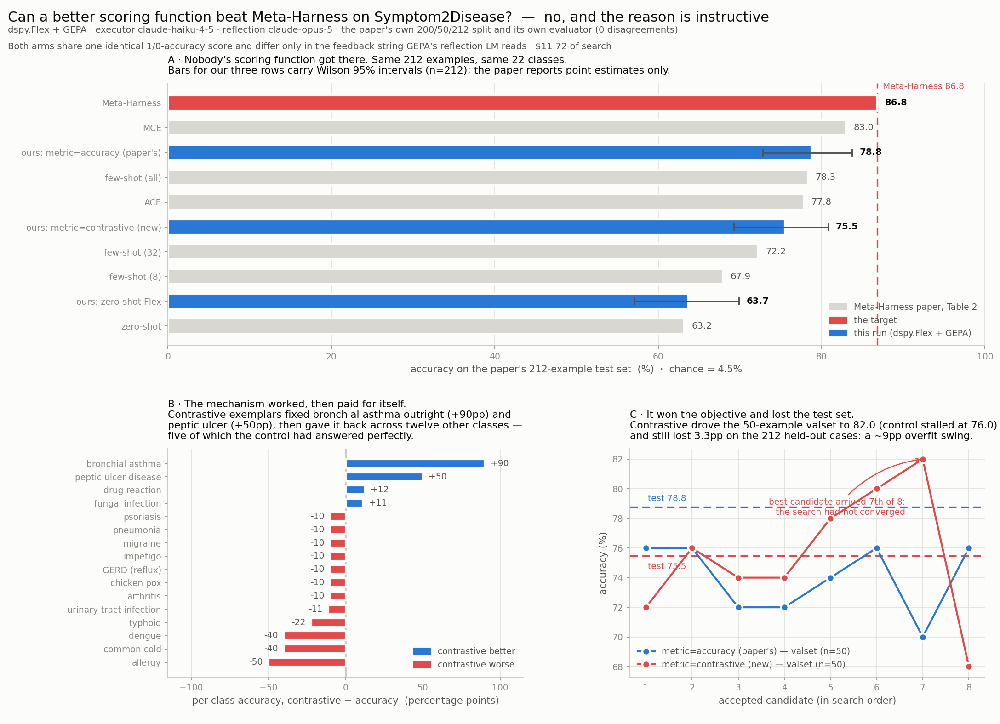

# Can a better scoring function beat Meta-Harness on Symptom2Disease?

**No.** Two GEPA arms on the paper's own split reached 78.8% and 75.5% against Meta-Harness's
**86.8%**. The scoring-function change under test — same score, richer feedback — did not beat the
paper's own plain-accuracy objective either: **−3.3pp, McNemar p = 0.35**, a wash.

The interesting part is not the headline. The new metric *did* do what it was designed to do, and
then paid the gain back somewhere else; and it drove the selection objective **higher** than the
control while landing **lower** on the test set. §3.2 and §3.3.



---

## 1. What Meta-Harness did

*Meta-Harness: End-to-End Optimization of Model Harnesses* — Lee, Nair, Zhang, Lee, Khattab, Finn,
[arXiv 2603.28052](https://arxiv.org/abs/2603.28052), code at
[stanford-iris-lab/meta-harness](https://github.com/stanford-iris-lab/meta-harness). It searches
over **harnesses**: the code around a fixed base model deciding what to store, retrieve and show.

Two facts were read out of the reference implementation rather than inferred from the paper,
because both decide what a fair comparison looks like.

**The data.** `reference_examples/text_classification/data/symptom_diagnosis/{train,val,test}.jsonl`
— **200 / 50 / 212** over **22** classes (the Kaggle 24 minus Acne and Dimorphic Hemorrhoids), fixed
by `config.yaml`: `Symptom2Disease: {num_train: 200, num_val: 50, num_test: 212}`. Those three files
are vendored byte-for-byte into `eval_data/`, read-only.

**The scoring function.** `data/evaluators.py::eval_symptom2disease` — a normalized exact-string
match returning a `bool`. That is the whole objective: **plain 0/1 accuracy, no penalty term.**
Context length enters only as a *secondary Pareto axis* (the "Ctx" column of Table 2), never
scalarized into the score.

So the `max(0, correct − λ·n_calls)` objective the sibling demos in this family sweep is **not** the
objective Meta-Harness optimized. Dropping λ is the first thing any run aiming at 86.8 should do.

**Its search:** population seeded from zero-shot / few-shot / ACE / MCE, then 20 iterations × 2
candidates = 40 candidate harnesses, proposed by Claude Code (Opus 4.6) with filesystem access to
every prior candidate's code, score and traces. Base model `openrouter/openai/gpt-oss-120b` at
temperature 0. The winner ("Label-Primed Query") is a label primer + one query-relevant example per
class + TF-IDF query-anchored contrastive pairs.

Table 2, Symptom2Disease column: zero-shot 63.2 · few-shot(8) 67.9 · few-shot(32) 72.2 ·
few-shot(all) 78.3 · ACE 77.8 · MCE 83.0 · **Meta-Harness 86.8**.

## 2. Method

`dspy.Flex(DiagnoseFromSymptoms)` optimized by `dspy.GEPA`. Flex lets GEPA rewrite the module's
*source*, so it can build multi-stage pipelines and plain Python, not just tune an instruction.

**The change under test.** Under DSPy the metric is not only a number — GEPA consumes
`ScoreWithFeedback`, and the *feedback* string is what the reflection LM reads when it rewrites the
program. That is a channel Meta-Harness's scalar `bool` does not have. Two arms:

| arm | score | feedback |
|---|---|---|
| `accuracy` (control) | 1/0 exact match | names the wrong label and the symptom text |
| `contrastive` (new) | **identical** 1/0 exact match | + labelled **training** exemplars of both confused classes, + a running confusion table across the whole search, + a coverage report of classes never once correct |

The score is byte-identical between arms, so the experiment isolates the feedback channel and
nothing else. The three additions target the mechanisms the paper's own discovered harness contains
— the difference is that here they must be *discovered* by GEPA rather than assembled by a proposer.

Held identical across arms: splits, seed 0, `max_metric_calls=600`, `reflection_minibatch_size=10`,
`skip_perfect_score=False`, executor `claude-haiku-4-5`, reflection `claude-opus-5`
(`max_tokens=32000`), caches disabled, 8 eval threads.

`disease` is a `Literal` over the 22 labels, so an off-label string is impossible. Every arm is
*also* scored under the paper's own matcher as a cross-check — **0 disagreements on all 636
predictions**, which is what turns "we used their evaluator" from a claim into a check.

## 3. Results

All on the paper's 212 held-out examples. Chance = 4.5%.

### 3.1 Headline

| system | acc % | 95% CI | macro-F1 | calls/ex | $/1k | mean latency |
|---|---|---|---|---|---|---|
| paper: zero-shot (gpt-oss-120b) | 63.2 | — | — | — | — | — |
| **ours: zero-shot Flex** (haiku-4.5) | **63.7** | [57.0, 69.9] | 0.602 | 1.00 | 0.71 | 1025 ms |
| paper: few-shot (all) | 78.3 | — | — | — | — | — |
| **ours: GEPA, `metric=accuracy`** | **78.8** | [72.8, 83.7] | 0.761 | 1.00 | 2.96 | 3255 ms |
| **ours: GEPA, `metric=contrastive`** | **75.5** | [69.3, 80.8] | 0.753 | 2.99 | 7.61 | 9212 ms |
| paper: MCE | 83.0 | — | — | — | — | — |
| **paper: Meta-Harness** | **86.8** | [81.6, 90.7]† | — | — | — | — |

† computed here from 86.8% of n=212; the paper reports a point estimate only.

- **The base-model confound is small.** Our zero-shot Flex scores 63.7% (135/212) where the paper's
  zero-shot with gpt-oss-120b scored 63.2% (134/212) — a one-example difference on the identical
  test set. haiku-4.5 and gpt-oss-120b are indistinguishable at zero-shot on this task, so the gap
  to 86.8 is attributable to the optimizer, not the executor.
- Both arms beat the zero-shot baseline decisively (control: 38 examples flipped right vs 6 wrong,
  McNemar **p = 9.4e-07**; contrastive: p = 0.0035).
- Neither approaches 86.8. Note the bar for a *defensible* claim is higher still: at n=212 you need
  **≥193/212 = 91.0%** for one-sided exact binomial p<0.05 against 86.8. Anything in 87–91% would be
  numerically ahead and statistically indistinguishable.

### 3.2 The mechanism worked, then paid for itself

Per-class accuracy, the classes that moved:

| class | `accuracy` | `contrastive` | Δ |
|---|---|---|---|
| bronchial asthma | 0.10 | **1.00** | **+90** |
| peptic ulcer disease | 0.20 | **0.70** | **+50** |
| drug reaction | 0.12 | 0.25 | +12 |
| fungal infection | 0.89 | 1.00 | +11 |
| allergy | 0.60 | 0.10 | **−50** |
| dengue | 0.70 | 0.30 | −40 |
| common cold | 0.80 | 0.40 | −40 |
| typhoid | 0.78 | 0.56 | −22 |
| urinary tract infection | 1.00 | 0.89 | −11 |
| GERD · migraine · pneumonia · psoriasis | 1.00 | 0.90 | −10 each |
| arthritis · impetigo | 0.90 | 0.80 | −10 each |
| chicken pox | 0.60 | 0.50 | −10 |

16 of 22 classes moved. Net: 17 examples flipped right, 24 flipped wrong. Five classes the control
had perfect (GERD, migraine, pneumonia, psoriasis, UTI) came off 1.00, and the largest single loss
is allergy at −50.

The control's program is worth reading to see why. It wrote a label primer plus a
hand-written discriminator per class — the paper's "label primer + coverage block", reached
independently — but from textbook medicine, because plain-accuracy feedback never shows it a real
case:

> `bronchial asthma: wheezing, shortness of breath, cough worse at night, chest tightness without fever.`

It still called those cases pneumonia 9 times out of 10. The corpus's asthma descriptions do not
match the textbook. Showing GEPA actual training exemplars fixed that class outright — the single
largest confusion in the control (asthma→pneumonia, 9 errors) disappeared completely. It then gave
the gain back across twelve other classes, five of which the control had answered perfectly.

### 3.3 It won the objective and lost the test set

Valset score of every accepted candidate, both arms starting from a 0.60 base:

| arm | candidate scores (in search order) | best | found at | test |
|---|---|---|---|---|
| `accuracy` | 0.76 0.76 0.72 0.72 0.74 0.76 0.70 0.76 | 0.76 | 1 of 8 → plateaued | **78.8** |
| `contrastive` | 0.72 0.76 0.74 0.74 0.78 0.80 **0.82** 0.68 | **0.82** | 7 of 8 → still climbing | **75.5** |

This is the finding. The contrastive metric drove the selection objective **6pp higher** and still
scored **3.3pp lower** on held-out data — a ~9pp swing in the generalization gap. Richer feedback
quotes literal training phrasings, so GEPA writes rules keyed to those phrasings: they fit a
50-example valset drawn from the same distribution and transfer worse to 212 unseen cases. §3.2 is
the same story per class — it learned exemplar-specific discriminators for the classes it saw fail,
at the cost of the classes that were already fine.

`budget_check.py` flags the contrastive arm as **still climbing** when the budget ran out, so its
75.5 is not a converged number. The control had plateaued by candidate 1.

### 3.4 The new metric is also 2.6× more expensive at inference

The contrastive arm built a three-stage pipeline (feature extraction → … → classification):
**2.99 LLM calls per example vs 1.00**, $7.61/1k vs $2.96/1k, 9212 ms vs 3255 ms mean per-request
latency. It bought worse accuracy at 2.6× the cost. With no λ in the objective there was nothing
stopping it — which is a fair argument *for* the penalty term this experiment deliberately removed,
in settings where inference cost matters.

## 4. Reproducibility

```
python run_compare.py                        # baseline + both arms, ~55 min, ~$14
python run_compare.py --report-only          # re-print the table from results.json
python plot_results.py                       # re-render the figure
python ../budget_check.py run.log            # was the budget adequate?
```

`results.json` holds per-example records for all three rows, so any other statistic — per-class,
confusion, cost, latency percentiles — is recomputable without re-running. `programs/` holds the
saved Flex programs; `gepa_log_*/` holds every candidate GEPA evaluated.

## 5. Validation performed

- **Split hygiene** checked, not assumed: 0 duplicate texts within test, 0 train/test overlap,
  0 train/val overlap. **1 example of the paper's val set also appears in its test set** (1/212 =
  0.47%). It is their split and both methods inherit it; reported by `check_data()`, not repaired.
- **The paper's own evaluator** re-implemented and run beside ours on every prediction: 0/636
  disagreements.
- **Reflection truncation** metered (`finish_reason == "length"`): 0 truncated calls in either arm;
  peak completion 8,467 tokens (control) and 17,101 (contrastive) against a 32,000 cap. This is the
  failure mode that once destroyed a whole run in this demo family and looked exactly like "the
  optimizer found nothing".
- **Off-label predictions**: 0 in every row.
- Every A>B claim significance-tested — McNemar (paired) between our own rows, exact binomial
  against the paper's aggregate.

## 6. Limitations

- **Executor is `claude-haiku-4-5`, not `gpt-oss-120b`.** No OpenRouter credentials in this repo.
  Mitigated but not eliminated by the zero-shot anchor matching to within one example (§3.1).
- **The test against 86.8 is unpaired and treats it as exact.** Meta-Harness's 212 per-example
  outcomes are not published, so no McNemar is possible, and 86.8 itself carries a ±~2.3pp interval.
- **Our output is enum-constrained**; the paper's harness emits free text into a
  `[DIAGNOSIS]…[/DIAGNOSIS]` tag and can lose points to formatting. That is an advantage to us, and
  it is on our side of the ledger in a comparison we still lost.
- **One seed, one budget.** No replicates, so the −3.3pp between arms is a single draw; p = 0.35
  already says it is not resolvable.
- **The contrastive arm never converged** (§3.3), so its 75.5 is a lower bound on what that metric
  would produce with more budget — though a larger valset matters more than more budget here.
- **Single-arm search, not a population.** Meta-Harness seeds from four baseline harnesses and keeps
  a Pareto population of 40; GEPA evolves one lineage from a bare `dspy.Predict`. Some of the 8pp
  gap is plausibly that, not the metric.

## 7. Cost

| item | measured |
|---|---|
| baseline test eval (212 ex) | $0.15 |
| arm `accuracy` — search (1136 calls, 1.85M in / 317k out) | $5.00 |
| arm `accuracy` — test eval | $0.63 |
| arm `contrastive` — search (1292 calls) | $6.72 |
| arm `contrastive` — test eval | $1.61 |
| **total** | **$14.11** |

Wall clock: 20 min (control) + 31 min (contrastive) of search. The contrastive arm is ~3× slower per
iteration because exemplar-laden feedback makes each reflective dataset much larger.

## 8. If continuing

The evidence points at the **valset**, not the metric. A 50-example valset over 22 classes gives
~2.3 instances per class: it cannot tell that fixing bronchial asthma is worth keeping while the
GERD regression is not, and it is small enough to overfit (§3.3). The next arm worth running scores
candidates against the 250 train+val examples instead of 50 — ~2,850 metric calls to buy the same
~10 candidates, ~$16–20 per arm.

Set expectations accordingly: that fixes selection, not proposal. If the discriminators GEPA can
write simply do not crack these classes, a bigger valset will not invent them. Reaching 86.8 looks
like even odds; clearing the 91.0% needed to beat it *significantly* looks unlikely.
